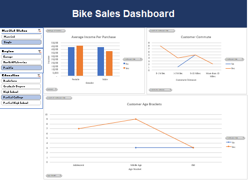

# Bike Sales Analysis

## Project Overview

This project analyzes customer demographics and purchasing behavior using Microsoft Excel. The dashboard helps identify factors influencing bike purchases, enabling businesses to target the right customer segments and improve marketing effectiveness.

---

## Business Problem

The company wanted to understand which customer demographics are most likely to purchase bikes and identify key factors affecting purchasing decisions.

---

## Dashboard

---

## Tools Used

- Microsoft Excel
- Pivot Tables
- Pivot Charts
- Slicers
- Data Cleaning

---

## Key Insights

### 1. Income Influences Purchase Decisions

- Female customers who purchased bikes had a slightly higher average income compared to those who did not.
- Male customers who purchased bikes also demonstrated relatively high income levels.
- Income appears to be a significant factor in bike purchasing behavior.

### 2. Commute Distance Impacts Purchasing Trends

- Customers with short commute distances (0–1 miles) showed the highest bike purchase rate.
- Purchase rates declined significantly among customers commuting more than 10 miles.

### 3. Middle-Aged Customers Are More Likely to Purchase Bikes

- The Middle Age customer segment recorded the highest number of bike purchases.
- Adolescent and Older age groups showed lower purchasing activity.

### 4. Customer Segmentation Matters

- Purchase behavior varies across demographic groups, highlighting the importance of targeted marketing strategies.

---

## Recommendations

- Focus marketing campaigns on middle-aged customers.
- Target higher-income customer segments with premium bike offerings.
- Promote bikes as a convenient commuting option for customers with shorter travel distances.
- Develop specialized promotions for younger and older customer groups to increase market penetration.

---

## Conclusion

The analysis indicates that customer income, age group, and commute distance significantly influence bike purchasing decisions. These insights can help businesses improve customer targeting and increase sales performance.

---

## Author

Madhumitha Balajayabalan

Business Analyst | Excel | Data Analytics | Dashboard Reporting# Bike-Sales-Analysis
